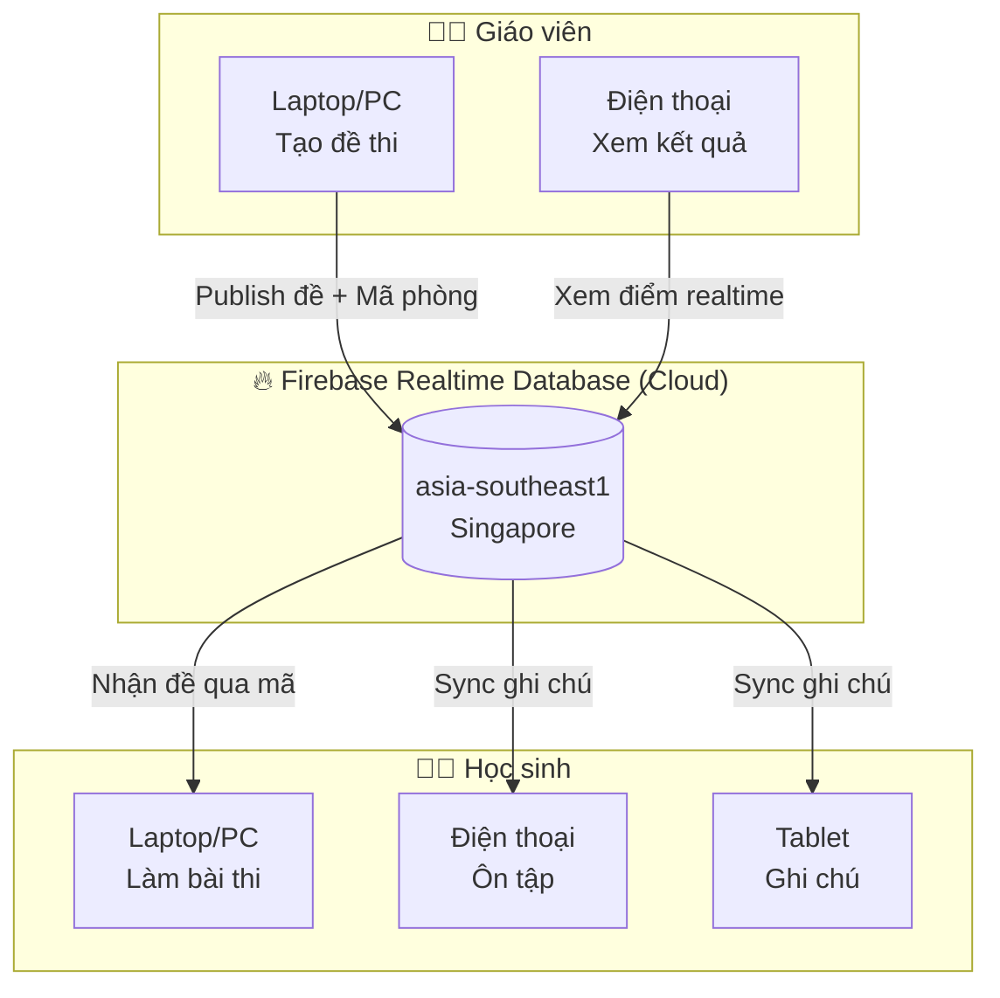
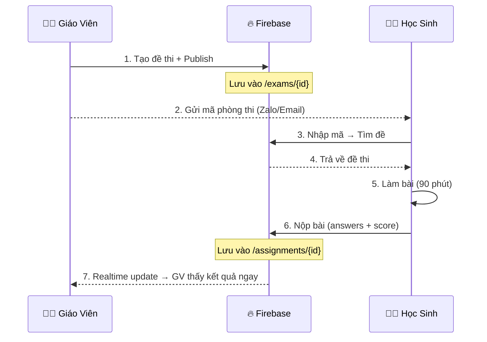

# 🔥 Hướng Dẫn Cài Đặt Firebase & Kết Nối Trực Tuyến GV ↔ HS

> [!NOTE]
> Firebase Realtime Database cho phép **Giáo viên** và **Học sinh** đồng bộ dữ liệu **theo thời gian thực** — giáo viên tạo đề, học sinh nhận đề và làm bài ngay lập tức trên các thiết bị khác nhau.

---

## Tổng Quan Kiến Trúc



---

## 📋 Các Bước Cài Đặt Từ A → Z

### Bước 1: Tạo Firebase Project (5 phút)

1. Truy cập 👉 **https://console.firebase.google.com/**
2. Đăng nhập bằng **tài khoản Google** (Gmail)
3. Nhấn **"Create a project"** → đặt tên: `hai-phong-math-olympiad`
4. **Tắt Google Analytics** (không cần) → nhấn **Create Project**
5. Đợi ~30 giây → nhấn **Continue**

> [!TIP]
> Firebase Spark Plan (miễn phí) cho phép: 1GB storage, 10GB transfer/tháng, 100 kết nối đồng thời — đủ cho cả lớp học!

---

### Bước 2: Tạo Realtime Database

1. Menu trái → **Build** → **Realtime Database**
2. Nhấn **"Create Database"**
3. Chọn vị trí: **`asia-southeast1 (Singapore)`** ← gần Việt Nam nhất
4. Security rules: chọn **"Start in test mode"** → **Enable**

> [!IMPORTANT]
> Test mode cho phép đọc/ghi 30 ngày. Sau khi app ổn, cần thêm Security Rules.

---

### Bước 3: Đăng Ký Web App & Lấy Config

1. Nhấn ⚙️ **Settings** → **"Project settings"**
2. Kéo xuống **"Your apps"** → nhấn biểu tượng **`</>`** (Web)
3. Đặt tên: `HaiPhong Math Web` → **KHÔNG** tick Firebase Hosting → **Register app**
4. 🎯 **Sao chép** đoạn `firebaseConfig`:

```javascript
const firebaseConfig = {
  apiKey: "AIzaSyB1234...",
  authDomain: "hai-phong-math-olympiad.firebaseapp.com",
  databaseURL: "https://hai-phong-math-olympiad-default-rtdb.asia-southeast1.firebasedatabase.app",
  projectId: "hai-phong-math-olympiad",
  storageBucket: "hai-phong-math-olympiad.firebasestorage.app",
  messagingSenderId: "123456789012",
  appId: "1:123456789012:web:abcdef1234567890"
};
```

5. Nhấn **"Continue to console"**

---

### Bước 4: Dán Config Vào App

1. Mở app → nhấn biểu tượng **⚙️ Cài Đặt** trên thanh Navbar
2. Chọn tab **"Firebase"**
3. **Dán** đoạn JSON config vào ô textarea
4. Nhấn **"Lưu Cấu Hình"**

> [!NOTE]
> Config được lưu trong localStorage của trình duyệt. Mỗi thiết bị cần dán config 1 lần.

---

## 🔗 Kết Nối Trực Tuyến: Luồng Giáo Viên ↔ Học Sinh

### Vai trò Giáo Viên 👨‍🏫

| Bước | Hành động | Kết quả |
|:-----|:----------|:--------|
| 1 | Chuyển sang vai trò **Giáo viên** (trên Navbar) | Hiện giao diện quản lý đề thi |
| 2 | Tab **"Soạn Đề"** → chọn chuyên đề, số câu → **Tạo Đề Thi** | AI Gemini sinh đề theo ma trận Hải Phòng |
| 3 | Tab **"Ngân Hàng Đề"** → mở đề vừa tạo → bật **"Công Khai"** | Đề được publish + có **Mã Phòng Thi** (VD: `HP-2024-001`) |
| 4 | **Gửi mã phòng thi** cho học sinh (qua Zalo, email...) | Học sinh dùng mã này để vào phòng thi |
| 5 | Tab **"Bài Nộp"** → xem kết quả realtime | Khi HS nộp bài → điểm tự động hiện lên |

### Vai trò Học Sinh 👨‍🎓

| Bước | Hành động | Kết quả |
|:-----|:----------|:--------|
| 1 | Chuyển sang vai trò **Học sinh** (trên Navbar) | Hiện giao diện học tập |
| 2 | Tab **"Phòng Luyện Thi"** → nhấn **"Nhập Mã Phòng Thi"** | Mở modal nhập mã |
| 3 | Nhập mã GV đã gửi (VD: `HP-2024-001`) + điền tên | Tìm và tải đề thi từ Firebase |
| 4 | Nhấn **"Bắt Đầu Thi"** → làm bài trong thời gian quy định | Bộ đếm giờ 90 phút bắt đầu |
| 5 | Hoàn thành → nhấn **"Nộp Bài"** | Bài thi được chấm tự động + gửi lên Firebase |

---

## 🔄 Luồng Đồng Bộ Realtime



---

## 📊 Dữ Liệu Được Đồng Bộ

| Loại dữ liệu | Firebase Path | GV ghi | HS ghi | Đồng bộ realtime |
|:---|:---|:---:|:---:|:---:|
| **Đề thi** | `/exams/{id}` | ✅ | ❌ | ✅ |
| **Câu hỏi** | `/exams/{id}/questions` | ✅ | ❌ | ✅ |
| **Bài nộp** | `/assignments/{id}` | ❌ | ✅ | ✅ |
| **Ghi chú học tập** | `/study_notes/{id}` | ❌ | ✅ | ✅ |

---

## ❓ Câu Hỏi Thường Gặp

**Q: Firebase có mất phí không?**
> Spark Plan (miễn phí): 1GB storage, 10GB transfer/tháng, 100 kết nối đồng thời. Đủ cho hàng trăm lớp học.

**Q: Không có mạng thì sao?**
> App tự động chuyển sang chế độ offline dùng localStorage. Khi có mạng lại → tự sync lên Firebase.

**Q: Mỗi máy cần cài gì không?**
> Không cần cài thêm gì. Chỉ cần mở web app trên trình duyệt và dán Firebase Config 1 lần.

**Q: Nhiều học sinh dùng cùng lúc có bị lỗi không?**
> Firebase hỗ trợ 100 kết nối đồng thời (plan miễn phí). Cả lớp 40-50 học sinh dùng cùng lúc hoàn toàn OK.

**Q: API Key Gemini có bị lộ không?**
> API Key Gemini được lưu riêng trong localStorage của từng máy, **KHÔNG** được sync lên Firebase.

---

---

## 🛡️ Cấu Hình Firebase Authentication & Security Rules

### 1. Bật Email/Password Provider (Bắt buộc cho hệ thống tài khoản GV & 8 HS)
1. Trên Firebase Console, vào **Build** → **Authentication**.
2. Chọn tab **Sign-in method** → nhấn vào **Email/Password**.
3. Bật công tắc **Enable** (đầu tiên) → nhấn **Save**.

---

### 2. Cập nhật Security Rules cho Realtime Database
Khi khởi tạo hoặc khi test mode 30 ngày hết hạn, vào **Realtime Database** → tab **Rules** và dán bộ Rules chuẩn sau:

```json
{
  "rules": {
    "exams": {
      ".read": true,
      ".write": true,
      "$examId": {
        ".validate": "newData.hasChildren(['id', 'title', 'access_code', 'exam_type', 'mode', 'duration_minutes', 'is_published', 'created_at'])"
      }
    },
    "assignments": {
      ".read": true,
      ".write": true,
      "$assignmentId": {
        ".validate": "newData.hasChildren(['id', 'exam_id', 'student_id', 'status', 'created_at'])",
        "score": { ".validate": "newData.isNumber() && newData.val() >= 0 && newData.val() <= 20" }
      }
    },
    "profiles": {
      ".read": true,
      ".write": true,
      "$userId": {
        ".validate": "newData.hasChildren(['id', 'email', 'role', 'full_name'])"
      }
    },
    "study_notes": {
      ".read": true,
      ".write": true,
      "$noteId": {
        ".validate": "newData.hasChildren(['id', 'student_id', 'topic', 'content_markdown', 'created_at'])"
      }
    },
    "$other": {
      ".validate": false
    }
  }
}
```

> [!IMPORTANT]
> 1. Thang điểm bài thi chuẩn Sở GD&ĐT Hải Phòng là **20.00 điểm** (rule: `newData.val() <= 20`).
> 2. Node `assignments` đã hỗ trợ cập nhật `teacher_feedback` và `graded_at` theo thời gian thực từ giáo viên.
> 3. Node `profiles` phục vụ việc đồng bộ thông tin đăng nhập của Giáo viên và 8 Học sinh.
